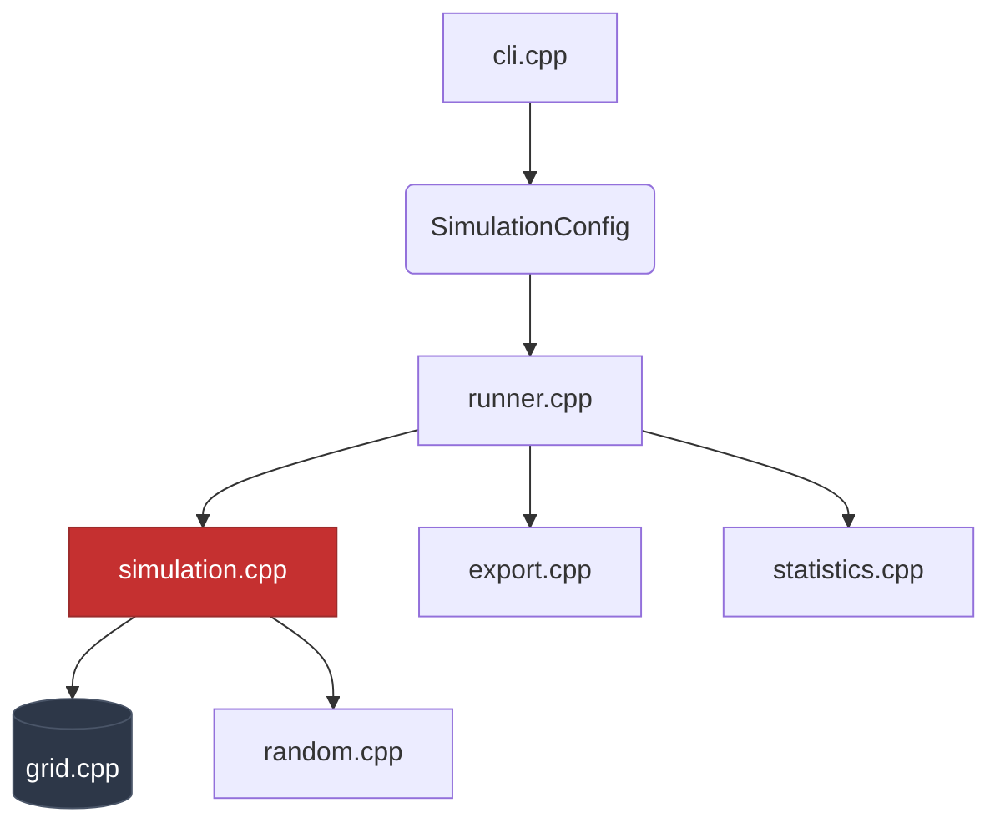
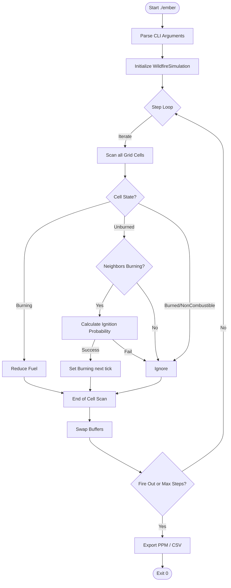

# EMBER Architecture Guide

This document describes the high-level design, main data structures, and execution flow of the **EMBER** stochastic wildfire simulator.

## 1. Overview
EMBER is a cell-based fire propagation simulation engine (modified Cellular Automata). It uses a probability model to determine how fire spreads, taking into account environmental factors such as fuel density, moisture, vegetation type, topography (slope), and wind.

## 2. Project Structure

The source code is strictly divided following the C/C++ standard:

*   **`include/ember/` (The Interfaces):** Defines the *what*. Contains the data structures and function declarations. This folder acts as the public API of the simulator.
*   **`src/` (The Implementation):** Defines the *how*. Contains the deep logic, execution loops, and mathematical calculations.



### Core Components

1.  **Configuration (`config.hpp` / `config.cpp`)**
    *   `SimulationConfig`: Stores all physical and environmental parameters (wind, fuels, ignition points).
    *   Ensures mathematical bounds are respected to prevent memory overflows before starting.

2.  **The Grid (`grid.hpp` / `grid.cpp`)**
    *   `GridBuffers`: The core of EMBER's memory. It uses a **Double Buffering** technique (two state arrays) for the fire state and fuel. This allows reading the state at instant `T` and writing the state for instant `T+1` simultaneously without data races.
    *   Terrain properties (moisture, vegetation, elevation) are stored in a single array because they remain static during the simulation.

3.  **The Physics Engine (`simulation.hpp` / `simulation.cpp`)**
    *   `WildfireSimulation`: Instance that manages *a single* scenario. Contains the `step()` function, which executes one simulation "tick".
    *   Uses custom pseudo-random number generators (PRNG) based on hashing (`random.hpp`) to ensure the simulation is deterministic and reproducible from a given `seed`.

4.  **The Runner (`runner.hpp` / `runner.cpp`)**
    *   `run_batch()`: Wraps the execution of one or multiple independent scenarios, collecting statistics and orchestrating the export of results.

5.  **Utilities**
    *   `cli.hpp`: Command-line argument parsing with zero external dependencies.
    *   `export.hpp`: Dumps the grid state to image files (`.ppm`) or CSV data.
    *   `statistics.hpp`: Collects performance metrics and damage statistics.

---

## 3. Execution Flow (Life of a Run)

To understand how everything fits together, let's track step-by-step what happens when a user executes the following command in the terminal:

```bash
./ember --width 1000 --height 1000 --wind-strength 0.8 --export ppm
```

### Step 1: Initialization and CLI (`main.cpp`)
The entry point calls `parse_cli()`. The parser reads the arguments and converts them into a `SimulationConfig` struct. Values that the user did not provide (like wind direction) fall back to their defaults. If there are errors (e.g., `--width -5`), it throws an exception and the program aborts.

### Step 2: Batch Bootstrapping (`runner.cpp`)
`main` passes the `SimulationConfig` to `run_batch()`. This validates that the configuration is mathematically viable and prepares a `BatchStatistics` container. It starts a loop to execute as many scenarios as requested (default is 1).

### Step 3: Scenario Preparation (`simulation.cpp`)
For each scenario, a `WildfireSimulation` instance is created and its `initialize()` method is called:
*   Allocates memory for the entire grid (1 million cells in our 1000x1000 example).
*   "Plants" the terrain: Using the scenario's random seed, it assigns moisture, elevation, and fuel levels to each cell.
*   Ignites the initial ignition point (sets state to `Burning`).

### Step 4: The Simulation Loop (The Engine)
The `run()` function starts a loop that calls `step()` repeatedly. What happens inside `step()` in *each* iteration?
1.  It scans all cells in the "current buffer".
2.  If a cell is already `Burned` or `NonCombustible`, it is ignored.
3.  If a cell is `Burning`, its fuel is reduced. If fuel reaches 0, it becomes `Burned` in the "next buffer".
4.  If a cell is intact (`Unburned`), it checks its 8 neighbors. If any neighbor is burning, it calculates an **ignition probability**.
    *   This probability is affected by wind (blowing towards it?), slope (fire traveling uphill/downhill?), moisture, and distance (diagonal neighbors are further away).
    *   A random "die" is rolled, and if successful, the cell will transition to `Burning` in the "next buffer".
5.  After scanning all cells, `swap_buffers()` is called so the "next buffer" becomes the "current buffer" for the upcoming tick.

### Step 5: Termination and Export
The `step()` loop ends if we reach the maximum number of steps (`max_steps`) or if the fire goes out naturally (zero burning cells).
At the end of the scenario:
*   The grid is scanned one last time to count casualties (burned cells).
*   Since the user requested `--export ppm`, the runner invokes `export_grid_ppm()`, which maps cell states to RGB colors and writes an image file.

### Step 6: Final Summary
`run_batch()` finishes, returns the global statistics back to `main.cpp`, and the console prints the burned area percentage and CPU times calculated by `statistics.cpp`. The program exits with code 0.


